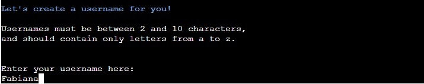
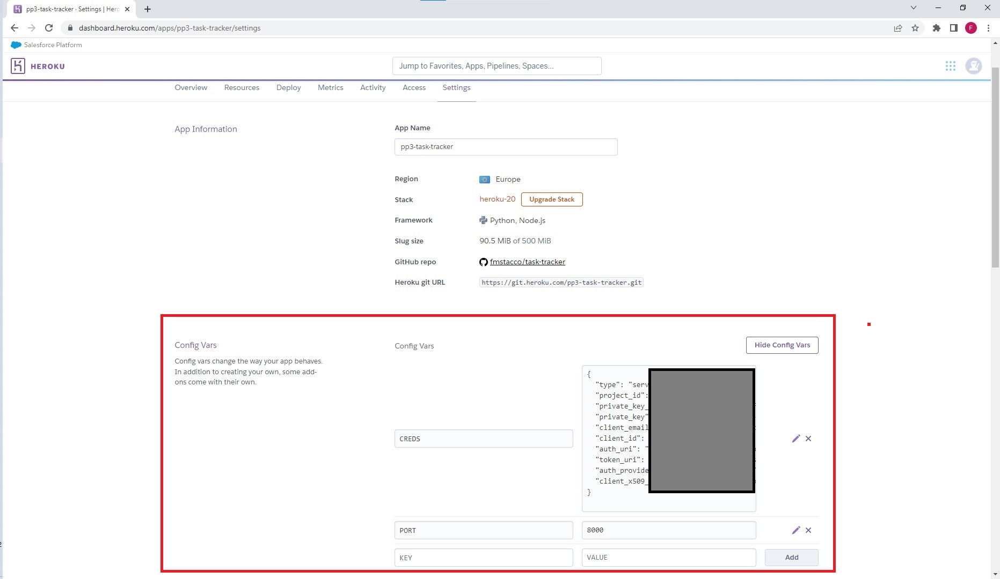

# **Carpe Diem Task Manager - Project Portfolio 3 - Python**

Carpe Diem Task Manager is a simple tool that helps people organize and track the tasks that need to be done in different aspects of life, for example, family, studies, work, etc.. 

Welcome to the live site here: <a href="https://pp3-task-tracker.herokuapp.com/" target="_blank">Carpe Diem Task Manager</a>

# Contents

* [**Objective**](<#objective>)
* [**User Experience UX**](<#user-experience-ux>)
    * [Target Audience](<#target-audience>)
    * [User Stories](<#user-stories>)
    * [Owner Stories](<#owner-stories>)
    * [Flow Chart](<#flowchart>)
* [**Features**](<#features>)
* [**Future Features**](<#future-features>)
* [**Technologies Used**](<#technologies-used>)
* [**Testing**](<#testing>)
* [**Deployment**](<#deployment>)
* [**Credits**](<#credits>)
    * [**Code**](<#code>)
*  [**Acknowledgements**](<#acknowledgements>)

# Objective 

The aim of this project is to deliver a command line interface task manager so the user can track their to do list. 

# User Experience (UX)

## Target Audience

* Anyone who wants to track and manage all the tasks that need to be done.

## User Stories

* As a new user I want to easily understand how to use the system and how it can help me.
* As a new user or returning visitor, I want to be able to easily navigate the system through the command line.
* As a new user I want to be able to create a unique username, add tasks to the system, view saved tasks as well as delete tasks.
* As a visitor returning, I want to be able to access the system through a unique username, add new tasks, retrieve previously saved tasks, as well as delete tasks.
* As a new user or returning visitor, I want to be able to close the system easily when I finish using it.

## Owner Stories

* As the owner, I want to offer a system that is easy to use for both the new user and a visitor returning, and helps the user better organize what needs to be done in their daily lives.
* As the owner, I want to ensure that the data entered is correct, valid and stored safely.

[Back to top](<#contents>)

## Flowchart

[Back to top](<#contents>)

## Features

### Welcome Screen

This is the welcome screen:

On this screen the user is asked to create a username:

This is the screen that the user will see if the username choosen is already taken:

This is the welcome screen for the new user, when typed [1] Create a new task list:

This is the welcome screen for the returning user, when typed [2] Access a saved task list:

This is the screen to add a new task, when typed [1] Add a new task:

This is the screen to view saved tasks, when typed [2] View your saved tasks:

This is the screen to delete tasks, when typed [3] View your saved tasks:

This is the screen to exit the system, when typed [4] to exit the task manager:

This is the Google Sheets database, where the data is stored and communicating with the task manager system.

[Back to top](<#contents>)

## Future Features

The Carpe Diem Task Manager can be improved in the future through new features to be developed and implemented:

**Update task Status** - A ***update task status feature*** is crucial so the user can update the task when completed. Due to time contrains it could not be developed.

**Color design** - a better ***color design*** and combinations to improve the user experience. 

**Login** - for future development it would be nice to have a ***signup and login with password*** feature in order to have a secure way to access the system. 

**Typing function** - a typing function/library to slow down the time the text is printed on the screen. It can be improved for a better user experience UX/UI.

[Back to top](<#contents>)

## Testing

### PEP8 validator 

### Fixed bugs: 

During the testing process, some minor errors were displayed when validating Python on PEP8, which were quickly corrected. 
    

### Manual testing

  * Manual Testing

| Feature            |  Expect                           |  Result              |
| ------------------ | --------------------------------- | ---------------------|
| Run Task Tracker   |  Display welcome screen           |         Pass         | 
| New user press [1] |  Display welcome new user menu    |         Pass         |
| Returning user [2] |  Display returning user menu      |         Pass         |
|  Invalid input     |  Message input is not valid       |         Pass         |
|  Add new task      |  Requests inputs to be filled     |         Pass         | 
|  Delete task       |  Requests task code to delete     |          Pass        | 
| Delete task sheets |  Delete task on google shets      |          Pass        |
|  Save task         |  Save task on google shets        |          Pass        |

### Testing User Stories

| Expectation                         | Result                          |
| :---------------------------------: | :------------------------------:|
| As a new user I want to easily understand how to use the system and how it can help me.| The user can understand the system through the welcome screen.|
| As a new user or returning visitor, I want to be able to easily navigate the system through the command line. |There user can navegate easily through the input buttons and options.|
| As a new user I want to be able to create a unique username, add tasks to the system, save tasks as well as delete tasks.|The user can create a unique username, add, save and also remove tasks from the system. |
| As a visitor returning, I want to be able to access the system through a unique username, add new tasks, retrieve previously saved tasks, as well as delete tasks.| The returning user can retrieve saved tasks, and also is able to add new tasks and also remove tasks from the system. |
| As a new user or returning visitor, I want to be able to close the system easily when I finish using it.|The users can exit the system easily through the main menu .|

[Back to top](<#contents>)

# Technologies Used

* [Python](https://docs.python.org/3/contents.html) - the main language of the application.
* [Gitbash](https://en.wikipedia.org/wiki/Bash_(Unix_shell)) - to push changes to the GitHub repository.
* [GitHub](https://github.com/) - to host the repositories.
* [Gitpod](https://www.gitpod.io/) - as the IDE for the application.
* [Google Cloud](https://cloud.google.com/) - to create a project for the API.
* [Google Sheets](https://www.google.co.uk/sheets/about/) - to store a database for the users tasks.
* [Heroku](https://www.heroku.com/) to deploy the project.
* [Lucid Charts](https://www.lucidchart.com/) - to create the flow chart.
* [PEP8](http://pep8online.com/) - for testing and validating the code.

[Back to top](<#contents>)

# Deployment

This application was deployed using [Heroku](https://www.heroku.com/):

To deploy using Heroku, the steps below need to be followed:

1. Ensure your requirements.txt file has the required dependencies. To do this you can use the following code in your IDE:
    > pip3 freeze > requirements.txt
    - Heroku will use this file to import the dependencies that are required.
3. Create or Login to your Heroku account.
4. Navigate to Dashboard. 
5. Click "New" and select "create new app" from the drop-down menu. This is found in the upper right portion of the window. 
6. Provide a unique name for your application and select your region.
7. Click "Create App".

### Setting up the App within Heroku

1. Navigate to "Settings" and scroll down to "build packs".
2. Click "build packs" and then click both "python" and "node.js"(node.js is needed for the Code Institute mock terminal.)
3. Ensure that the python buildpack is above the node.js buildpack, You can click and drag the packs to re-arrange them.

### App Deployment

1. Navigate to the "Deploy" section.
2. Scroll down to "Deployment Method" and select "GitHub".
3. Authorise the connection of Heroku to GitHub.
4. Search for your GitHub repository name, and select the correct repository.
5. For Deployment there are two options, Automatic Deployments or Manual.
    - Automatic Deployment: This will prompt Heroku to re-build your app each time you push your code to GitHub.
    - Manual Deployment: This will only prompt Heroku to build your app when you manually tell it to do so. 
6. Ensure the correct branch is selected "master/Main", and select the deployment method that you desire.

### **To fork this repository on GitHub**

A fork of this repository can be made which will allow you to make changes to this project without affecting the original repository. 

The steps below should be followed to ***fork*** the respository:

1. Log in to ***GitHub*** and find the [repository](https://github.com/fmstacco/task-tracker).

2. Click on the button ***fork*** on the right-hand side of the page to create a copy of the original repository in your GitHub account.

See the image below:

[Back to top](<#contents>)

### **To create a local clone of this project**

The steps below should be followed to ***clone*** the respository:

1. On the repository’s page, click on the ***code*** tab.
2. On the ***Clone with HTTPS*** tab, click on the icon (see image below) to copy the URL.

3. Open ***Git Bash*** on your IDE terminal.
4. Change the current working directory to the location where you want the cloned directory.
5. Type ***git clone***, and then paste the URL copied from GitHub.

Type: git clone + https://github.com/fmstacco/task-tracker.git

6. Press ***enter*** and the local clone will be created.

Help on cloning a repository from GitHub can be found [here](https://docs.github.com/en/repositories/creating-and-managing-repositories/cloning-a-repository).

[Back to top](<#contents>)

### Python Libraries

* [colorama](https://pypi.org/project/colorama/) to print text to the terminal in different colours and styles.
* [gspread](https://developers.google.com/sheets/api) - to link the database spreadsheet with Google Sheets.
* [google.oauth2.service_account](https://google-auth.readthedocs.io/en/stable/index.html) to import credentials and access to Google service accounts.
* [pandas](https://pypi.org/project/pandas/) - to display the tasks saved in a table format.

# Credits 

* [Alura](https://www.alura.com.br/) to reinforce learning on Python.

* [Code Institute Python Project template](https://github.com/Code-Institute-Org/python-essentials-template-v1) - the framework for this project.

* [Youtube Gustavo Guanabara](https://www.youtube.com/watch?v=S9uPNppGsGo&list=PLHz_AreHm4dlKP6QQCekuIPky1CiwmdI6) - to reinforce learning on Python.

* [Personalized task manager in Python](https://www.geeksforgeeks.org/personalized-task-manager-in-python/) - inspired me to structure my project.

* [Create a Task Tracker](https://www.youtube.com/watch?v=ynd67UwG_cI&t=351s) - inspired me to structure my project.

## Code

* [GitHub Mortgage Calculator](https://github.com/frankiesanjana/mortgage-calculator/) - Carpe Diem Task Manager code was developed having as a main inspiration this repository. I borrowed some of the code from the Mortgage calculator repository to help create the task manager, to save the user, send the tasks to the spreadsheet, retrieve it, etc. I have also customized the code to achieve the project goals.  

* [Simple Personality Quiz](https://github.com/edubz99/Simple-Personality-Quiz) - this repository was also among my initial inspirations for the quiz. 

* [Youtube Code Feature](https://www.youtube.com/watch?v=XnH56whHQqw) - this tutorial was my first inspiration for the quiz. I even deployed the walkthrough I have done following this tutorial. However, I ended up choosing the WebShala tutorial, as this one uses the HTML as a database for the questions, not a separated file on JavaScript. 

* [Sweet Alert](https://sweetalert.js.org/) - the code for the alert for the unsuccessful form submission.

* [EmailJS](https://www.emailjs.com) - the code to make the form effective for submitting potential clients' data to my email.  

[Back to top](<#contents>)

# Acknowledgements

Carpe Diem Task Manager was designed and developed for Portfolio 3 project, a requirement of Full Stack Software Developer Diploma Course (Eccommerce) at the [Code Institute](https://codeinstitute.net/). I would like to thank my mentor [Precious Ijege](https://www.linkedin.com/in/precious-ijege-908a00168/), my Cohort facilitator [Kenan Wright](https://se.linkedin.com/in/kenan-wright-bb0359b8), my Cohort colleagues, the Slack community, the Tutor Support and the Student care for all support during this journey. I am also thankful to the ***Mayo, Sligo and Leitrim Education Training Board (msletb)*** for this opportunity. I  would also like to say thank you to my family, my husband Michel and, my children, Alanna, and Peter who is just 5 months old at the time of this project submission. 

Fabiana Tacco (2022)

[Back to top](<#contents>)